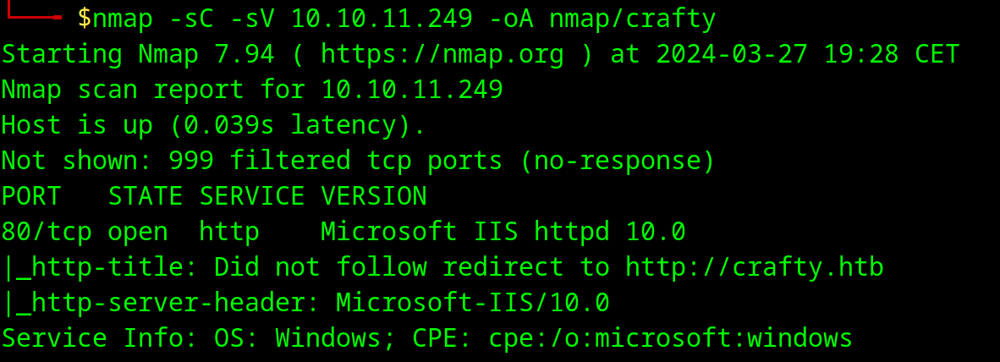

## Enumeration

Just a classic <kbd>`nmap`</kbd> scan to start:



We add `crafty.htb` to `/etc/hosts` and visit the website.  

The website is blank. <kbd>`ffuf`</kbd> doesn't find any other files than the ones that are linked on the site. It's a dead end. We can also use [shortscan](https://github.com/bitquark/shortscan) but we don't find anything useful either.

We can also enumerate subdomains with <kbd>`ffuf`</kbd> :

```bash
ffuf -w subdomains.txt -u http://10.10.11.249 -H "HOST: FUZZ.crafty.htb"
```

We find `play.crafty.htb` but it just redirects to the main one.

So not much to go on. But we haven't enumerated everything. Let's go for 2 more ports scans.

```bash
# first an all ports scan
sudo nmap -p- crafty.htb -T3

# then a UDP scan
sudo nmap -sU crafty.htb -T3
```


Full port scan shows `minecraft` is open which is probably a Minecraft server.


## Log4Shell

After enumerating with <kbd>`nmap`</kbd> we get the running version `1.16.5` which is vulnerable to [Log4Shell](https://en.wikipedia.org/wiki/Log4Shell). 
This was one of the most serious vulnerabilities affecting many programs using `Log4J Java logging library`

We download the [POC](https://github.com/kozmer/log4j-shell-poc) and set it up as is described. Then we can download a  
[Minecraft launcher](https://tlauncher.org/en/) or this [python library](https://github.com/ammaraskar/pyCraft) to establish a connection to the server. 
I just connected to the server and just posted the payload into the chat.
After a while we get reverse shell.

## Privilege escalation

I upgraded my reverse shell to a `meterpreter` shell with <kbd>`mfvenom`</kbd> and <kbd>`mfconsole`</kbd>. After exploring a bit we find that there is not much to go on.  

There is a `C:\Users\svc_minecraft\Server\plugins` directory with a JAR file.  

Maybe there could be something useful inside. Let's try to decompile it.
After decompiling it in an [online decompiler](http://www.javadecompilers.com/) we get a potential password. Pretty random.


The password `s67u84zKq8IXw` is available but we can't login as easily as the reverse shell is non interactive and we are prompted for password.

So I downloaded [RunasCs](https://github.com/antonioCoco/RunasCs/) from the releases and uploaded it via <kbd>`mfconsole`</kbd>. Then on the box I ran:

```powershell
PS C:\programdata> .\RunasCs.exe Administrator s67u84zKq8IXw "cmd /c whoami"
crafty\administrator
```

We get root. **`Pwned!`**
