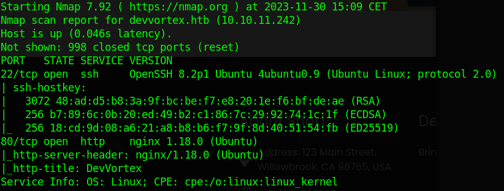
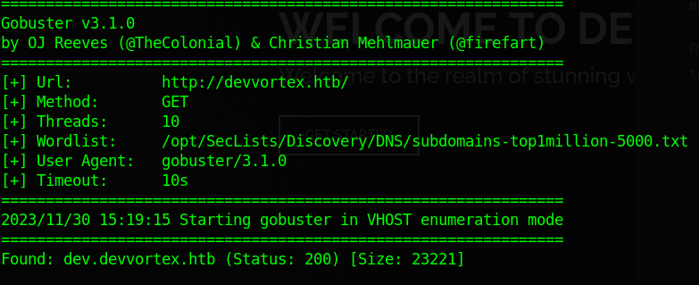
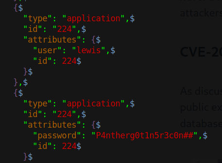
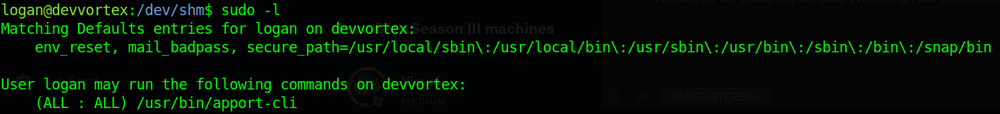

## Enumeration

First an <kbd>`nmap`</kbd> scan: 

```bash 
sudo nmap -sC -sV devvortex.htb -oA nmap/devvortex.htb
```


First I ran it with the IP address but then I always run it with the domain name also because nmap uses different scripts




Next I used <kbd>`feroxbuster`</kbd> with wordlists for directories and files and found nothing. 
Then I used <kbd>`gobuster`</kbd> to enumerate virtual hosts and found something:

```bash
gobuster vhost -u http://devvortex.htb/ -w /opt/SecLists/Discovery/DNS/subdomains-top1million-5000.txt
``` 



### Website

So next I added it to `/etc/hosts` and accessed it.

When running <kbd>`feroxbuster`</kbd> and <kbd>`gobuster`</kbd> on `dev.devvortex.htb` we run upon some errors.
First we have to append the `/` to the end of the search result to find a directory.
If we look for one that doesn't exist we get a custom 404 site where there is a link to the home site like this:
`http://dev.devvortex.htb/index.php`. 
So we have `PHP` being used.

Found a `Joomla Administrator Login page` at 

`http://dev.devvortex.htb/administrator/`

Also ran <kbd>`nmap`</kbd> with same parameters against `dev.devvortex.htb` and found a `robots.txt`.
The sites included again signal this is a site using `Joomla CMS`.
Then I found that I can get the version by going to `http://dev.devvortex.htb/README.txt`.
The version of `Joomla CMS` being used is `4.1`. After searching for a public `CVE` I found this [link](https://vulncheck.com/blog/joomla-for-rce). 
This allows us to send a HTTP request with <kbd>`curl`</kbd> like this:

```bash
curl -v http://dev.devvortex.htb/api/index.php/v1/config/application?public=true -o out.json
```

This gets us a JSON output which we can prettify with <kbd>`jq . pretty-out.json`</kbd>. 
Inside we can find the database username and password.



Then I enumerate all the possible usernames I found at the index pages and tried to SSH with <kbd>`crackmapexec`</kbd>.
None worked. Then I logged in to `/administrator/`. This worked.

### Admin panel

When we first login we find a security alert saying the site is using `PHP 7.4.3` which is an outdated version.
We are also a `SuperUser` and there is another user called `logan`.
We can then create our own PHP file under `/templates/casiopeia` that spawns a reverse shell. 

## Initial shell

We are the `www-data` user. We can check the MySQL database with the credentials we found earlier. 
We find the user `logan` and his hash. Interestingly he's also a user on the box. 
So when we crack his `bcrypt` hash with:

```bash
hashcat -m 3200 hash /usr/share/wordlists/rockyou.txt
```

we get his password and we can SSH as him.

## Privilege escalation to root

We can run <kbd>`sudo -l`</kbd> to see if we can run any commands because we have the password. 
We see sudo is using an old version so we could exploit that. We see an old Ubuntu is running so we could 
try to exploit that. But first we can run the `apport-cli` as sudo, as shown here:



While we run it the program with `sudo`, we have the option to view logs. If we select that and wait, we get thrown 
into a `less` pager. Inside it we can simply run any shell command with <kbd>`!/command/to/run`</kbd>.
So we run <kbd>`!/bin/bash`</kbd> and voila, we have a root shell. <kbd>`Pwned!`</kbd>

## Post privilege escalation

Can we exploit `sudo` or the old version of `Ubuntu` that is running?

Trying to get the `sudo` exploit to work failed. Even tho the `sudo` version is `1.8.31` the exploit and the 
test still don't work for some reason. 

