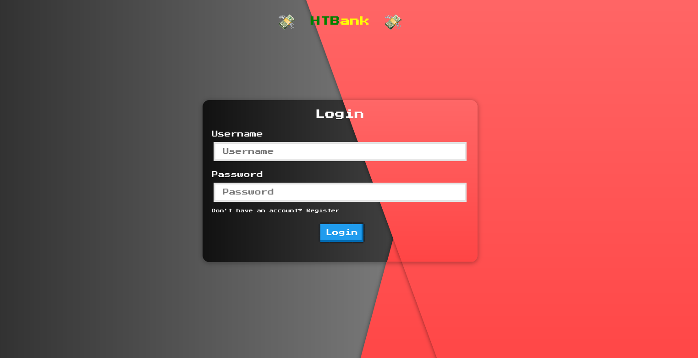
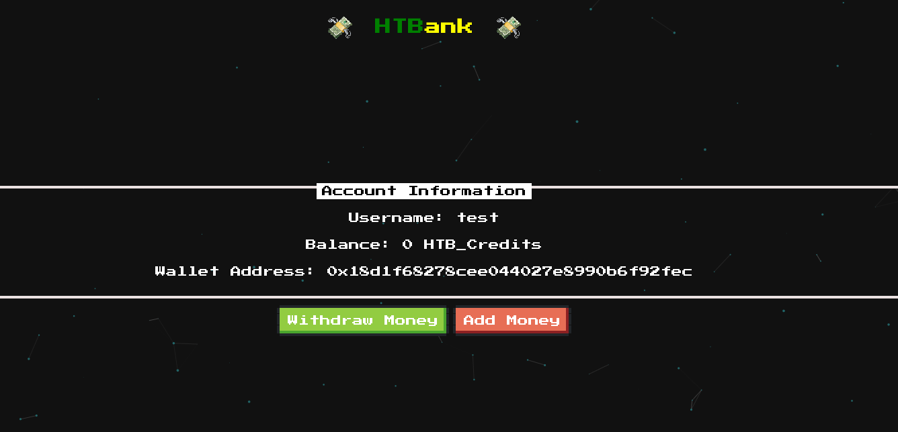
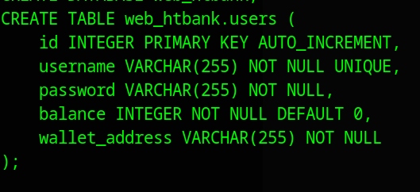

# HTB easy web challenge - HTBank

Let's look at this supposedly easy challenge from Hack the Box.

## Website

So first we'll manually explore the website. Let's jump in. 

We're first greeted with a login page. 



If we register a user and login we land on the `/home` page. It looks like this.



So this is a bank app and we have a wallet address which is a hex number and the wallet has a balance.
If we try to withdraw the money we get and error.
The add money button doesn't work and there is no Javascript function to trigger it like the withdraw one.
If we look we find this interesting piece of Javascript in the `home.js` file. 

```javascript
var xhr = new XMLHttpRequest();
xhr.open('GET', "https://api.etherscan.io/api?module=account&action=balance&address=0x5A0b54D5dc17e0AadC383d2db43B0a0D3E029c4c&tag=latest&apikey=FH12Z2IYGM3JKD1RN42NG6VHSXV73YX61H", true);
xhr.send();
xhr.onreadystatechange = processRequest;
function processRequest(e) {
  var response = JSON.parse(xhr.responseText);
  var bal = (response.result / Math.pow(10, response.result.length));
  $('.bal').text(bal.toFixed(4));
}
```

It looks like it's sending a `GET` request to an API of a cryptocurrency wallet address if I take a wild guess but we see the JQuery part `$('.bal').text(bal.toFixed(4));` that then adds it to a HTML element (probably a div). 

So my instinct tells me this is just a decoy, I doubt that our account balance is based on client side code. The balance is usually stored somewhere safe in a database for example. So let's look at the code and learn more about how the site works.

## Code analysis

When we open the challenge we see we have two directories `/flask_frontend` and `/php_backend`. So we're dealing with two different technologies - PHP and Python. What we just viewed is probably the frontend so let's take a look at that first. 

### Frontend part

 We know it's a `Flask` app and from the imports we can see it's using `MySQL`. Let's get a feel of the land first and check the routes. 

`/register` - simple function, we first check if the user exists, if no then we add him to the database

`/login` - simple login function, we set a session cookie and in the `login_user_db` function we generate a [JWT](https://en.wikipedia.org/wiki/JSON_Web_Token) token.

`/home` - this is the first interesting function, we get the user from the database, and also we get the flag if the `show_flag` condition is met. So it looks like the flag is in the database. 

```python
@web.route('/home')
@isAuthenticated
def home(decoded_token):
    user = getUser(decoded_token.get('username'))
    flag = getFlag()
    
    if(flag[0].get('show_flag') == 1):
        return render_template('home.html', user=user[0], flag=flag[0].get('flag'))


    return render_template('home.html', user=user[0])
```

We can confirm this by checking the `entrypoint.sh` script which generates the database when the container starts.


So there is this show flag functionality which is at first turned off, if we manage to turn it on somehow we can view the flag. We also have the users table present here which confirms our previous assumption that the balance is stored in a database.




So let's explore more.

`/api/withdraw` - this route is probably the most interesting

```python
@api.route('/withdraw', methods=['POST'])
@isAuthenticated
def withdraw(decoded_token):
    body = request.get_data()
    amount = request.form.get('amount', '')
    account = request.form.get('account', '')
    
    if not amount or not account:
        return response('All fields are required!'), 401
    
    user = getUser(decoded_token.get('username'))

    try:
        if (int(user[0].get('balance')) < int(amount) or int(amount) < 0 ):
            return response('Not enough credits!'), 400

        res = requests.post(f"http://{current_app.config.get('PHP_HOST')}/api/withdraw", 
            headers={"content-type": request.headers.get("content-type")}, data=body)
        
        jsonRes = res.json()

        return response(jsonRes['message'])
    except:
        return response('Only accept number!'), 500
```

We see that we send a POST request to this route with the account data and amount we want to withdraw, then it checks the users balance (if he has enough money) and if the value is not negative, then it sends another POST request to the `PHP` backend we saw earlier, also to an API endpoint `/api/withdraw`. 

So my first thought is SQL injection because the flag is in the database. So I check the `database.py` to look if anything looks odd. We have this `query()` function

```python
def query(query, args=(), one=False):
    cursor = mysql.connection.cursor()
    cursor.execute(query, args)
    rv = [dict((cursor.description[idx][0], value)
        for idx, value in enumerate(row)) for row in cursor.fetchall()]
    return (rv[0] if rv else None) if one else rv
```

and it gets called like this :

```python
user = query('SELECT username FROM users WHERE username = %s AND password = %s', (username, password,), one=True)
```

It looks a bit weird, we're doing some sort of string formatting and this could be potentially vulnerable although I don't have much experience in `Flask` and can't tell if this is right away. So after reading some documentation and playing with this for a bit trying some injections I gave up as this is probably not injectable as there is some sort of sanitization built-in inside this function.

`utils.py` has some utility functions like JWT token generation, verification and decoding.

`config.py` has the database configuration and the PHP backend server info. 

## PHP Backend

So here we have the backend part. At first glance we se we're using the [MVC](https://en.wikipedia.org/wiki/Model%E2%80%93view%E2%80%93controller) pattern. This backend is much simpler. We have a single route which is the one we saw earlier `/api/withdraw` which calls this `WithdrawController` index function. Let's see what it does.

```php
class WithdrawController extends Controller
{
    public function __construct()
    {
        parent::__construct();
    }

    public function index($router)
    {
        $amount = $_POST['amount'];
        $account = $_POST['account'];

        if ($amount == 1337) {
            $this->database->query('UPDATE flag set show_flag=1');

            return $router->jsonify([
                'message' => 'OK'
            ]);
        }

        return $router->jsonify([
            'message' => 'We don\'t accept that amount'
        ]);
    }

}
```

We get the parameters we send with POST, we check if the ammount to withdraw is equal to 1337, if it is we set `show_flag` option to true.

The first thing that comes to my eyes is this part

```php
if ($amount == 1337)
```

PHP is [known](https://owasp.org/www-pdf-archive/PHPMagicTricks-TypeJuggling.pdf) for it's type juggling vulnerabilities and here we have a loose comparison `==`, so maybe we could abuse this, but as we know from earlier, we also have a couple of checks in the frontend part, to see if the account has enough money to withdraw it. So after playing with this for a bit trying to bypass these checks (the frontend ones are problematic as there is where we check the balance) I gave up as I it didn't yield any results and I couldn't find anything online. So what now?

## Solution - HTTP Parameter Pollution

So what if we could somehow trick the frontend server to read a different `amount` value than the backend server? Here comes [parameter pollution](https://book.hacktricks.xyz/pentesting-web/parameter-pollution) to save the day. After reading about it for a while we can see that different servers behave differently about which value to choose if for example we would submit two `amount` values. 

`PHP` with Apache/Nginx for example takes the last value, while `Flask` takes the first one. Bingo!

So I intercepted the request with `Burp` and copied the boundary and the data.


We can see we get a OK message which means the request was successful and the backend server updated the flag option. We can now read it from the `/home` page. Pwned!
